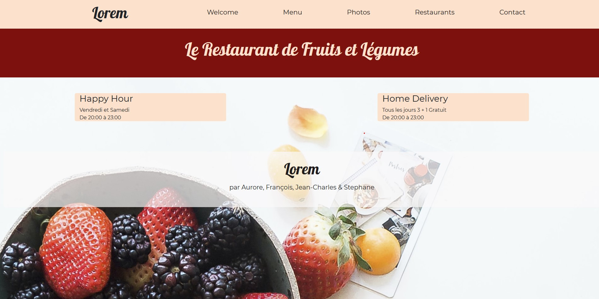
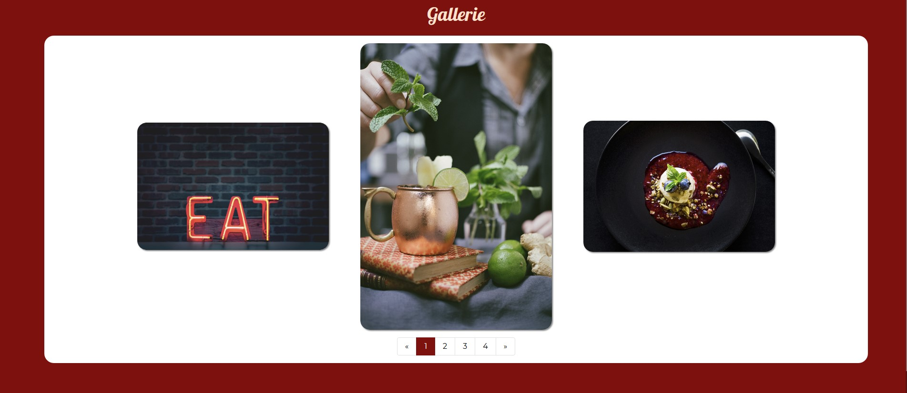

# Projet : Bootstrap

Creation of a fictive restaurant's website. This is a teamwork realized in a 3 days sprint while learning @Becode.

[Link to the project (Github Page)](https://riizbae.github.io/restaurant-css-framework/index.html)

The amazing team : [Aurore Limage](https://github.com/riizbae), [Jean-Charles Brognez](https://github.com/jcbrognez), [Stéphane Kalonji](https://github.com/kalonjis) et [François Wauters](https://github.com/fwauters).

## Photo Credentials

All images come from [Unsplash](https://unsplash.com/).
